# hse24_hw2
 
 # Ссылка на google colab ноутбук.
https://colab.research.google.com/drive/10C9EJ0o17tyoaHR0qTZXHMW2wCDjT6jm
# Выдача FastQC
## ENCFF649LQY
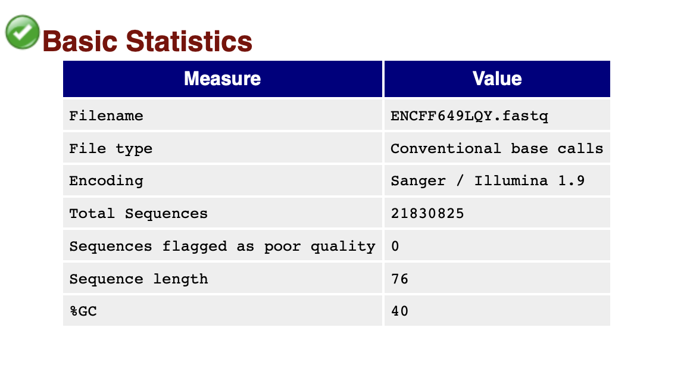

## ENCFF877QYT
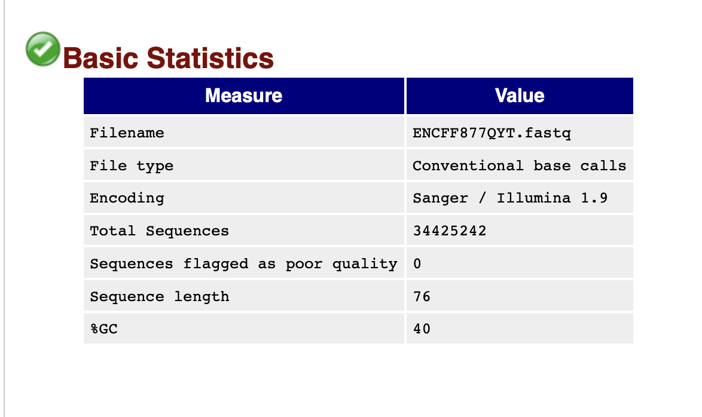
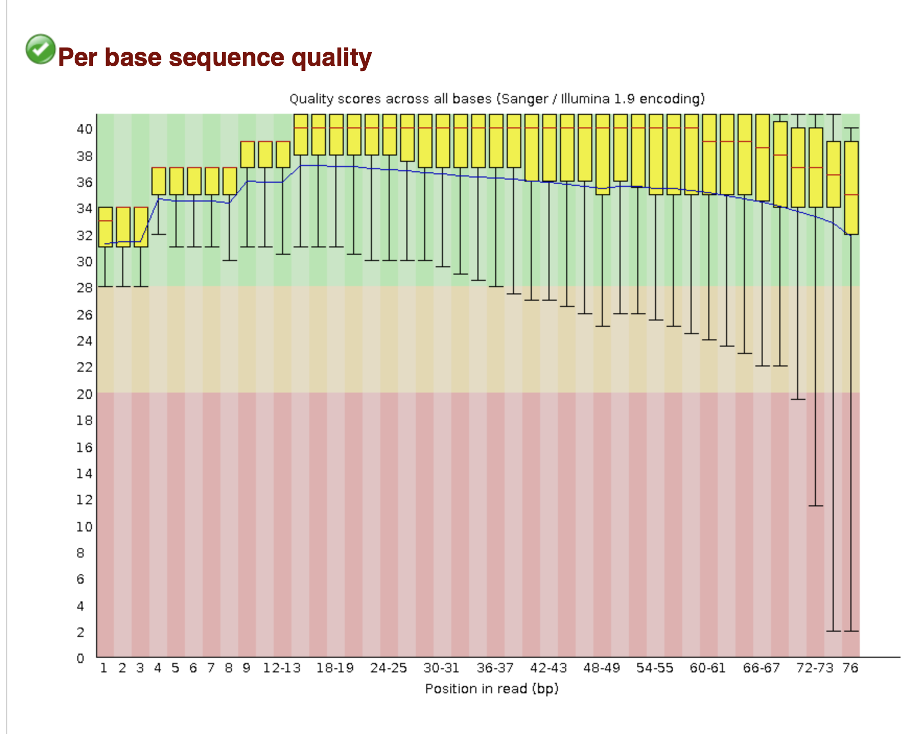
## ENCFF364HZK
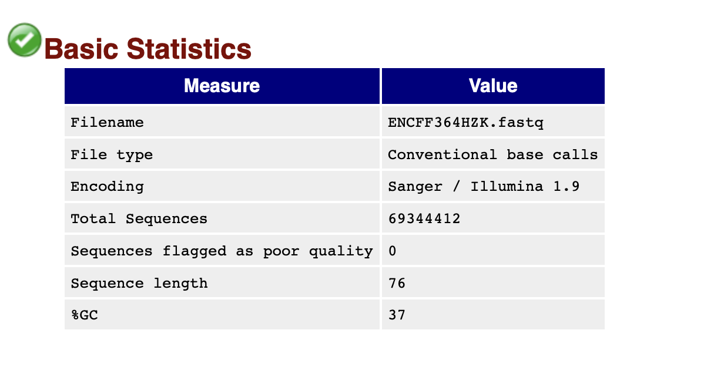
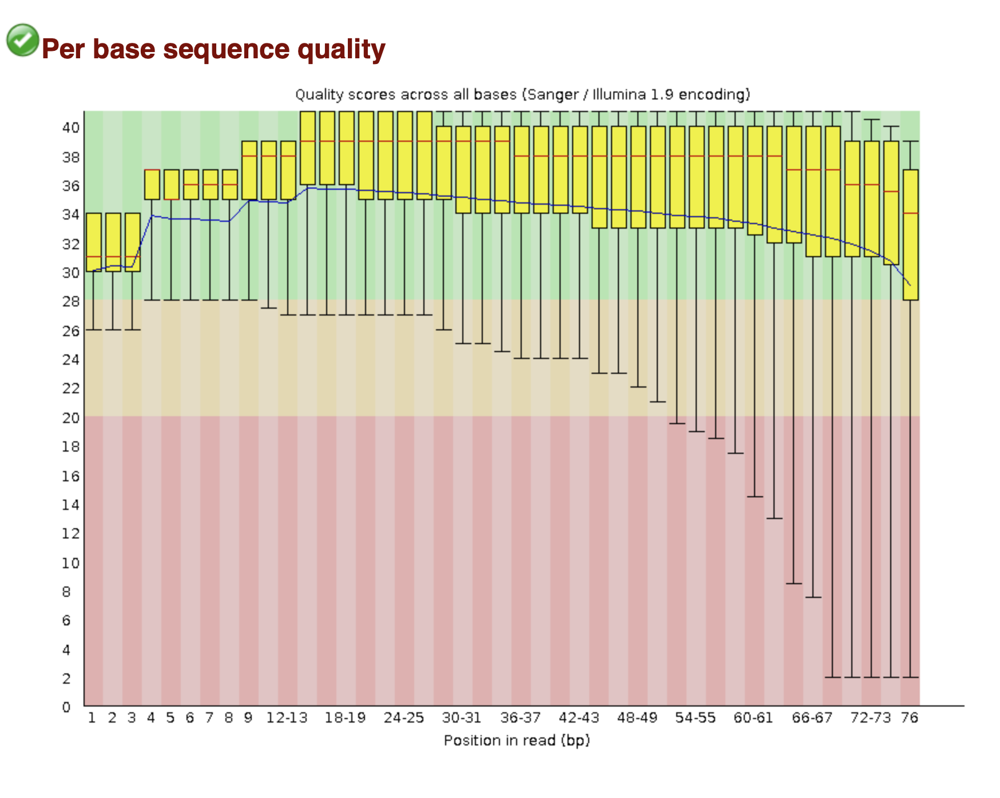

## MultiQC
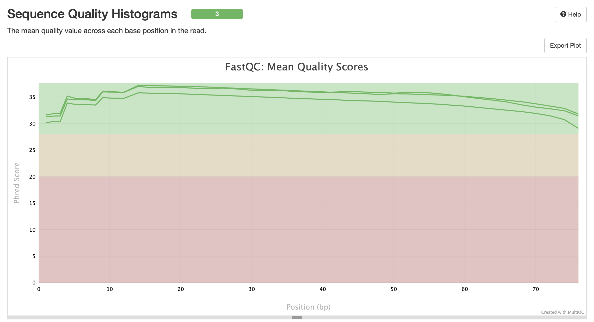

### Мини-вывод
Как можно увидеть на результатах FastQC и MultiQC качество чтений в fastqc файлах достаточно хорошее. Поэтому было принято решение не фильтровать и не подрезать чтения.

# Таблица со статистикой по каждому из 3 образцов:

| Образец | Ридов в файле | Уникально выравнившиеся риды | Не-уникально выравнившиеся риды | Не выравнившиеся риды |
|---------|---------------|-------------------------------|---------------------------------|----------------------|
| ENCFF649LQY| 21830825          | 882684                           | 1691747                            | 19256394                  |
| ENCFF877QYT| 34425242          | 1410567                          | 2708870                             | 30305805                   |
| ENCFF364HZK| 69344412           | 2820775                          | 4540146                             | 61983491                   |

## Почему процент выравниваний получился именно таким?
Получен низкий процент выравнивания, так как риды со всего генома мы картируем лишь на одну хромосому. 

# Диаграмма Венна
## ENCFF649LQY
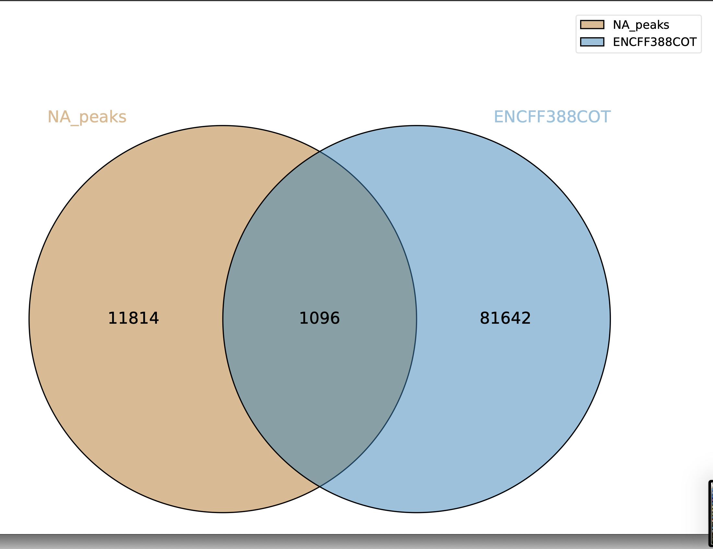
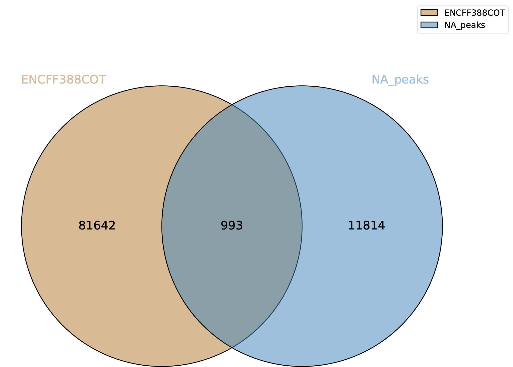
## ENCFF877QYT

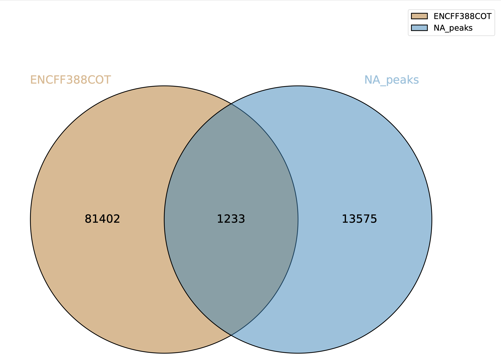

### Проанализируйте полученные результаты и приведите свои рассуждения в README.md. Как можно объяснить различия в количестве пересечений?
Количество пересечений отличается, поскольку в одном случае берутся полученные пики, пересекающиеся с пиками ENCODE; а в другом случае отбираются пики ENCODE, совпавшие с пиками, которые получили мы.

# Результаты выполнения бонусного задания
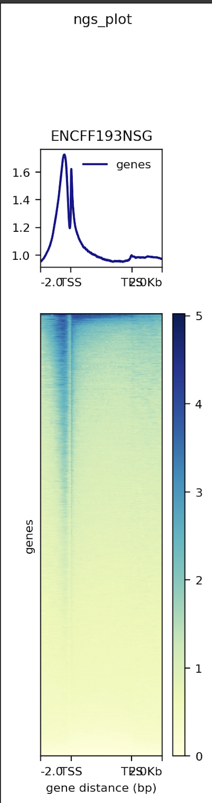
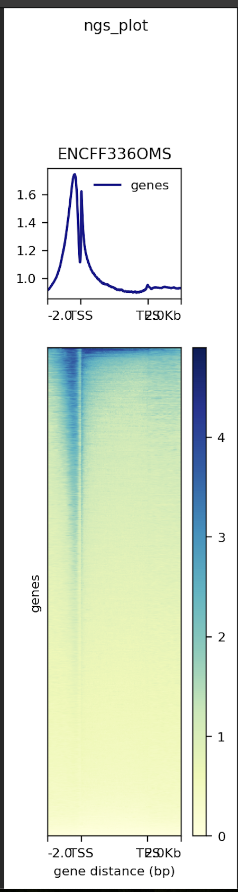
Данные ChIP-seq эксперимента из ENCODE согласуются с данными из статьи.